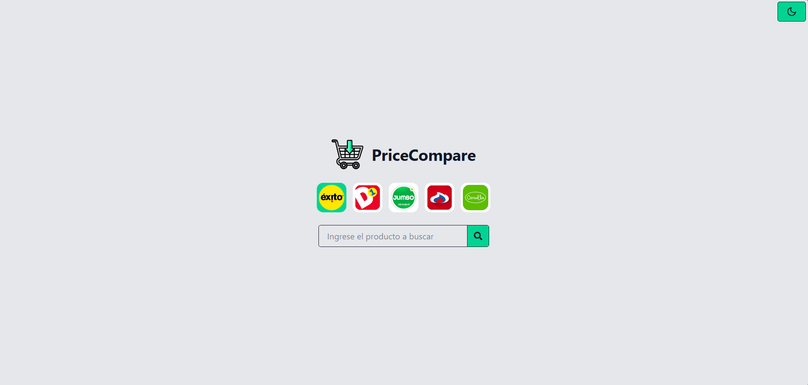
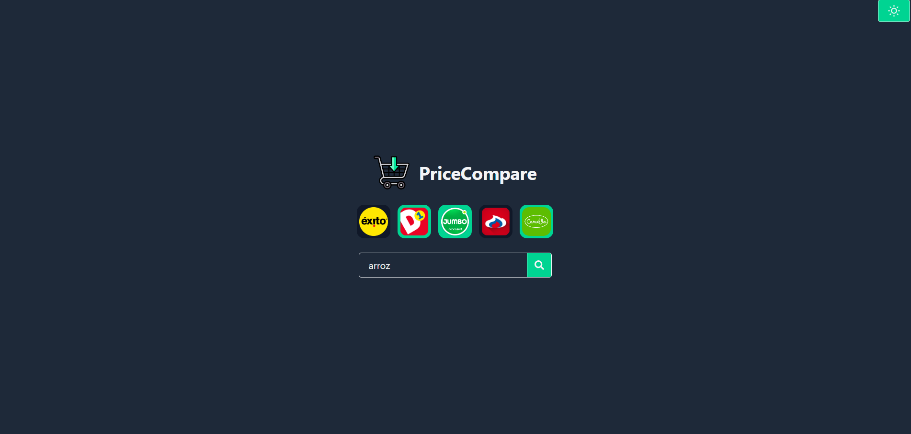
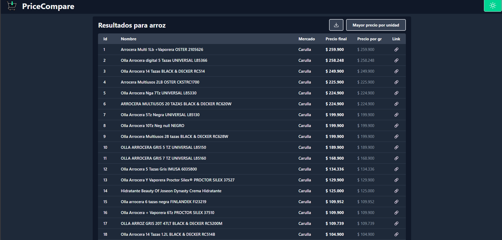

# Acerca de PriceCompare



## Descripción

Herramienta web que extrae información de las principales cadenas de supermercados, mostrando el precio de los productos en tablas, con funcionalidad de exportación a Excel y modo claro/oscuro.

## Demo

[Ver demo en vivo](https://pricecompare-seven.vercel.app/)

## Características

- Barra de busqueda junto a seleccion de multiples supermercados
  
- Generación de tabla detallada mediante scraping, con opción de exportación a Excel
  

## Aprendizajes

- Aprendizaje de scraping seguro y eficiente (capaz de buscar alrededor de 20 productos por segundo)
- Diseño de interfaces responsive con Tailwind CSS
- Filtrado de datos para reducir la sobrecarga y mejorar el rendimiento

## Tecnologías


## Instalación Local

```bash
git clone https://github.com/WilloAndru/TrabajoOmar.git
cd TrabajoOmar
npm install
npm run dev
```
